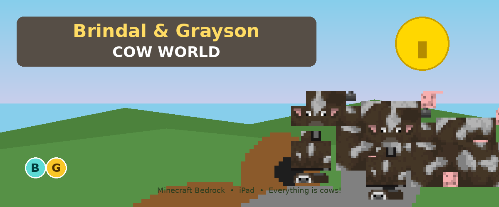
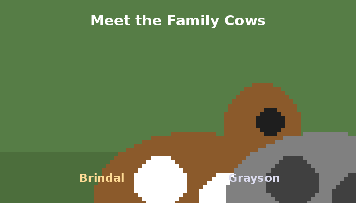

<p align="center">
  
</p>

# Charles' World of Chaos

**A Minecraft Bedrock add-on** — chaos barn gameplay with **vanilla cow skins** (AI/cel skins reset).

> **Repo:** [charles-world-of-chaos](https://github.com/russfranky/charles-world-of-chaos) — release filenames stay `brindal-grayson-cow-pack.*` for in-place updates.

Build your **Cow Barn**: tap the **Ranch Bell** to deploy, feed, breed, and recall your herd. Catch wild cows with the **Feed Bag**, chase rare coats like **Spot Cow** and **Storm Cow**, and unlock real Minecraft rewards (gold, emerald, diamond) as you fill your trait catalog.

| | |
|---|---|
| **Cow Barn** | Tap Ranch Bell — no typing needed |
| **Feed Bag** | Feed your cows or catch wild ones nearby |
| **Breeding** | Inherit traits, discover new combos, earn loot |
| **Pack size** | Lite overlay (~230 KB) — fast on iPad |

<p align="center">
  
</p>

---

## iPad install (5 minutes)

<p align="center">
  
</p>

### Step 1 — Download

Tap this link on the iPad in **Safari** (always the latest release):

**[Download brindal-grayson-cow-pack.mcaddon](https://github.com/russfranky/charles-world-of-chaos/releases/latest/download/brindal-grayson-cow-pack.mcaddon)**

> Every merge to `main` auto-bumps the pack version and publishes a new release — re-import the link above to **update** (no duplicate error).

### Step 2 — Open in Minecraft

When the download finishes, tap the file → **Open in Minecraft**. Both packs import automatically.

### Step 3 — Create a NEW world

> Important: use a **new** world, not an old one.

When creating the world, turn **ON**:

- **Holiday Creator Features** — Spot Cow & Storm Cow entities
- **Beta APIs** — Cow Barn (Ranch Bell, Feed Bag, breeding)

Then under world settings, activate **both** packs:
- **Charles' World of Chaos** (resource)
- **Charles' World of Chaos BP** (behavior)

### Step 4 — Play!

Open inventory → **tap the Ranch Bell** to cycle barn modes.

```
Ranch Bell  →  DEPLOY · FEED · BREED · RECALL
Feed Bag    →  feed cow or catch wild cow
```

Optional slash commands for parents: `/bgcow:help`, `/bgcow:barn`, `/bgcow:breed` — see [docs/COMMANDS.md](docs/COMMANDS.md).

📖 **Full install guide:** [docs/installation.md](docs/installation.md)  
🎮 **Cow Barn guide:** [docs/COMMANDS.md](docs/COMMANDS.md)

---

## Cow Barn at a glance

| Control | What happens |
|---------|--------------|
| **Ranch Bell** (tap) | Cycle deploy → feed → breed → recall |
| **Feed Bag** (tap) | Feed active cow, or catch wild cow within 5 blocks |
| `/bgcow:barn` | Show rank, herd, catalog progress |
| `/bgcow:breed` | Breed two ready adults |

Barn ranks grow with herd size (Pen → Yard → Ranch → Spread → Legend). New trait discoveries drop gold, emeralds, diamonds, and more.

---

## Requirements

| Requirement | Why |
|-------------|-----|
| **Minecraft Bedrock** on iPad | This is not Java Edition |
| **Version 1.21.0+** | Update the app if import fails |
| **New world** | Experiments must be set at world creation |
| **Holiday Creator Features** | Spot Cow & Storm Cow (behavior pack) |
| **Beta APIs** | Cow Barn scripts |

### Visual-only fallback

If experiments cause trouble, use the lighter pack (textures only, no scripts):

**[brindal-grayson-cow-pack.mcpack](https://github.com/russfranky/charles-world-of-chaos/releases/latest/download/brindal-grayson-cow-pack.mcpack)**

---

## Troubleshooting

| Problem | Fix |
|---------|-----|
| Ranch Bell does nothing | Turn on **Beta APIs** — create a **new** world |
| **No cows anywhere** | Need **Beta APIs** ON + **new** world. On join, cows spawn beside you + spawn eggs in inventory. Turn on **Holiday Creator Features** for Spot/Storm cows. |
| Spot/Storm cows won't spawn | Turn on **Holiday Creator Features** — create a **new** world |
| Can't breed yet | Need 3+ cows (Yard rank) and two happy adults |
| Checkerboard textures | Activate **both** resource and behavior packs |
| Packs missing | Re-download `.mcaddon`; restart Minecraft |
| Import failed | Update Minecraft to 1.21.0+ |
| **"Duplicate pack"** on import | Open the link again — **v1.0.1** should update in place. If not: Settings → **Storage** → delete **both** old **Charles' World of Chaos** packs (resource + BP) → import again |

---

## For parents

- **[Getting Started Guide](docs/GETTING_STARTED.md)** — plain-language walkthrough
- **[Marketplace Checklist](docs/MARKETPLACE.md)** — path to store readiness (in progress)
- **[Cow Barn Guide](docs/COMMANDS.md)** — bell cycle, breeding, loot
- **[Install Guide](docs/installation.md)** — detailed iPad steps

---

## Build from source

```bash
pip3 install -r requirements.txt
./scripts/build-mcaddon.sh                    # algorithmic + GUI
export VENICE_API_KEY='your-key'              # optional AI textures
./scripts/build-mcaddon.sh
python3 scripts/generate_docs_images.py         # regenerate README images
./scripts/clean.sh                              # remove local build artifacts
```

See [docs/development.md](docs/development.md) and [TESTING.md](TESTING.md).

---

## License

MIT — see [LICENSE](LICENSE). Minecraft assets derived from [Mojang bedrock-samples](https://github.com/Mojang/bedrock-samples).
