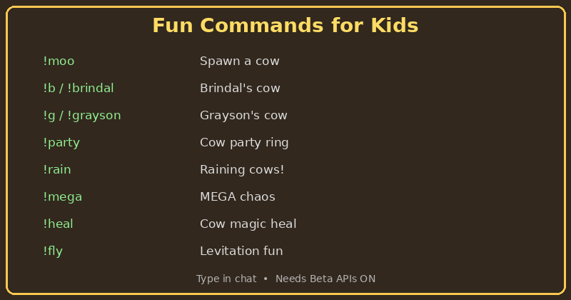
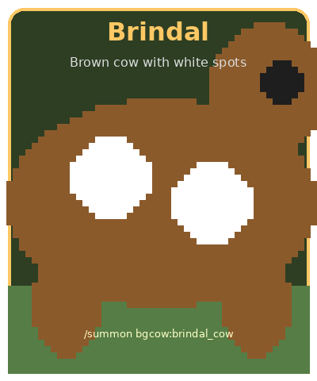

# Cow World Commands

Fun commands for **Brindal** and **Grayson**!

<p align="center">
  
</p>

**Requires Beta APIs** enabled when creating the world.

---

## Full command list

Every chat shortcut, matching slash command, and what it does:

| Chat shortcut | Slash command | What happens |
|---------------|---------------|--------------|
| `!moo` | `/bgcow:moo` | A cow pops in and moos |
| `!b`, `!brindal` | `/bgcow:brindal` | Brindal's brown cow appears |
| `!g`, `!grayson` | `/bgcow:grayson` | Grayson's gray cow appears |
| `!twins` | `/bgcow:twins` | Both cows at once |
| `!party` | `/bgcow:party` | Ring of cows around you 🎉 |
| `!rain` | `/bgcow:rain` | Cows fall from the sky |
| `!stampede` | `/bgcow:stampede` | Cows charge toward you |
| `!mega` | `/bgcow:mega` | SO many cows (can lag older iPads) |
| `!heal` | `/bgcow:heal` | Full heal + regeneration glow |
| `!fly` | `/bgcow:fly` | Float up, fall down slow |
| `!jump` | `/bgcow:jump` | Super jump boost |
| `!sunny` | `/bgcow:sunny` | Clear sunny day + cows |
| `!night` | `/bgcow:night` | Nighttime cheese moon |
| `!milk` | `/bgcow:milk` | Free milk bucket |
| `!feast` | `/bgcow:feast` | Wheat, milk, and cookies |
| `!bell` | `/bgcow:bell` | Cowbell concert |
| `!love` | `/bgcow:love` | Both cows + hearts |
| `!cowify` | `/bgcow:cowify` | Turn nearby mobs into cows |
| `!surprise`, `!?` | `/bgcow:surprise` | Random silly cow chaos! |
| `!dance` | `/bgcow:dance` | Cow dance party spiral |
| `!boom`, `!fireworks` | `/bgcow:boom` | Fireworks + cows |
| `!hug` | `/bgcow:hug` | Brindal & Grayson hug + cookies |
| `!zoom`, `!fast` | `/bgcow:zoom` | Super speed cow trail |
| `!joke`, `!lol` | `/bgcow:joke` | Silly cow joke |
| `!disco` | `/bgcow:disco` | Glowing disco cows |
| `!help`, `!cowhelp` | `/bgcow:help` | Show all commands |

**Tip for iPad:** The `!` shortcuts are easiest — kids just type in chat, no slash menu needed.

---

## Slash commands (autocomplete)

Type `/` in chat and search `bgcow:` to pick a command from the menu.

Or type `/bgcow:help` in chat for the full list.

---

## Meet the star cows

<p align="center">
  
  
</p>

| Cow | Command | Summon |
|-----|---------|--------|
| **Brindal** | `!b` | `/summon bgcow:brindal_cow` |
| **Grayson** | `!g` | `/summon bgcow:grayson_cow` |

These cows are special — they won't get removed or turned into regular cows by `!cowify`.

---

## Tips for parents

- Commands work **without traditional cheats** enabled
- Any player in the world can use them
- `!mega` and `!rain` spawn many cows — can lag older iPads
- If commands don't work, check **Beta APIs** is ON (requires new world)
- The behavior-pack description in Minecraft world settings also mentions the Beta APIs requirement

---

## No Script API?

If Beta APIs are off, vanilla summon still works:

```
/summon bgcow:brindal_cow
/summon bgcow:grayson_cow
```

You won't get `!moo` / `!party` without Beta APIs.
