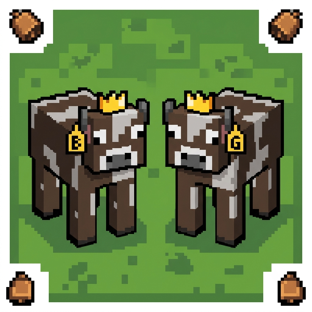
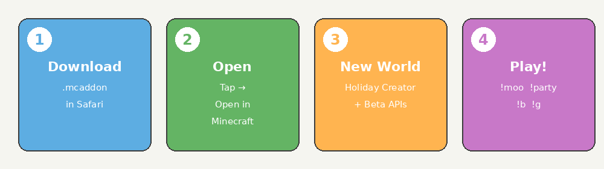

# Getting Started — For Parents

A plain-language guide to setting up **Brindal & Grayson Cow World** on an iPad.

<p align="center">
  
</p>

## What is this?

A free Minecraft add-on with two special cows named after your kids:

- **Brindal Cow** — brown with white spots
- **Grayson Cow** — gray with dark spots

Kids can spawn cows, throw cow parties, make it rain cows, heal themselves, and more with simple chat commands like `!moo` and `!party`.

They'll also see cow-spot textures on blocks and items, a silly title screen, and custom menu music.

## What you need

- An **iPad** with **Minecraft Bedrock Edition** (the normal App Store Minecraft — not Java)
- Minecraft updated to **version 1.21 or newer**
- About **5 minutes** and Wi‑Fi to download the pack (~750 KB)

## Install step by step

<p align="center">
  
</p>

### 1. Download on the iPad

Open **Safari** on the iPad and go to:

https://github.com/russfranky/brindal-grayson-cow-pack/raw/main/dist/brindal-grayson-cow-pack.mcaddon

Tap **Download**. Wait for it to finish.

> **From a Mac?** AirDrop the file to the iPad, or save to iCloud Drive and open from the Files app.

### 2. Open in Minecraft

Tap the downloaded file. Choose **Open in Minecraft**.

You should see a message that packs were imported. If nothing happens, try tapping the file in the **Files** app → Share → Minecraft.

### 3. Create a new world

This part matters — **don't use an old world**.

1. Open Minecraft → **Play** → **Create New**
2. Pick any world name (e.g. "Cow World")
3. Before creating, tap **Game Settings** or the experiments section
4. Turn **ON**:
   - **Holiday Creator Features** — needed for Brindal & Grayson custom cows
   - **Beta APIs** — needed for `!moo` and other fun commands
5. Scroll to **Resource Packs** → activate **Brindal & Grayson Cow World**
6. Scroll to **Behavior Packs** → activate **Brindal & Grayson Cow World BP**
7. Tap **Create**

### 4. Let the kids play!

Open chat (tap the chat icon) and type:

```
!moo
```

A cow should appear. Try `!party`, `!b`, and `!g` next.

## Commands cheat sheet (printable)

Give the kids this list:

| Type this | What happens |
|-----------|--------------|
| `!moo` | Spawn a cow |
| `!b` | Brindal's cow |
| `!g` | Grayson's cow |
| `!party` | Cow party! |
| `!rain` | Raining cows |
| `!mega` | SO many cows |
| `!heal` | Get healed |
| `!fly` | Float up |
| `!help` | See all commands |

Full list with every shortcut: [COMMANDS.md](COMMANDS.md)

## Is it safe?

- No account or login beyond normal Minecraft
- No internet needed after download (offline play works)
- Commands don't require turning on "cheats" in the traditional sense
- It's a hobby project — open source on GitHub

## Something wrong?

| Symptom | What to try |
|---------|-------------|
| `!moo` does nothing | Beta APIs must be ON — create a **new** world |
| Brindal/Grayson cows won't appear | Holiday Creator Features must be ON — **new** world |
| Purple/black checkerboard textures | Both packs must be active in world settings |
| Can't download | Check iPad storage and Minecraft version (1.21+) |

See [installation.md](installation.md) for more troubleshooting.

## Updating the pack

Re-download the `.mcaddon` link above and open in Minecraft again. Create a new world to pick up changes.

---

**Have fun!** 🐄
