# Mob Index — Pre-publish approval

Visual catalog of every mob texture in the pack. **Approve mobs in
[`mob-approvals.json`](mob-approvals.json)** before publishing.**

Regenerate after texture changes:

```bash
python3 scripts/generate_mob_index.py
```

Open [`index.html`](index.html) in a browser for the full gallery.

**2 shipped** · **2 approved** · 27 total

## Shipped in pack

### ✅ Brindal Cow (`brindal_cow`)


- **Identifier:** `bgcow:brindal_cow`
- **Texture:** `textures/entity/brindal_cow.png`
- **Note:** Auto-added — set approved true after visual review

### ✅ Grayson Cow (`grayson_cow`)

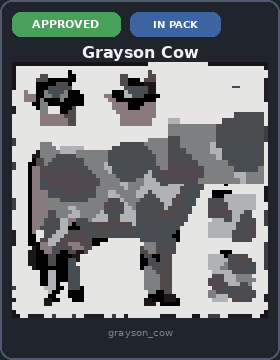

- **Identifier:** `bgcow:grayson_cow`
- **Texture:** `textures/entity/grayson_cow.png`
- **Note:** Auto-added — set approved true after visual review

## Venice catalog (not shipped)

### ⏳ Bee (`bee`)

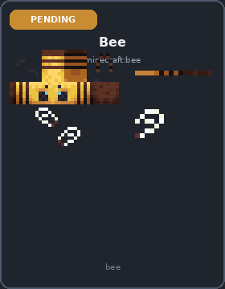

- **Identifier:** `minecraft:bee`
- **Texture:** `textures/entity/bee/bee.png`
- **Note:** Auto-added — set approved true after visual review

### ⏳ Blaze (`blaze`)

_no preview_

- **Identifier:** `minecraft:blaze`
- **Texture:** `textures/entity/blaze.png`
- **Note:** Auto-added — set approved true after visual review

### ⏳ Breeze (`breeze`)

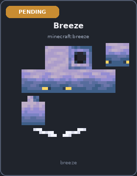

- **Identifier:** `minecraft:breeze`
- **Texture:** `textures/entity/breeze/breeze.png`
- **Note:** Auto-added — set approved true after visual review

### ⏳ Cat (`cat`)

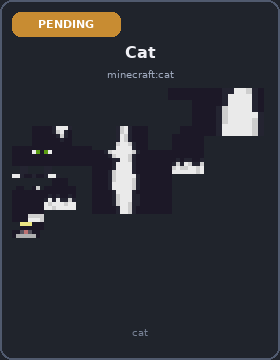

- **Identifier:** `minecraft:cat`
- **Texture:** `textures/entity/cat/blackcat.png`
- **Note:** Auto-added — set approved true after visual review

### ⏳ Chicken (`chicken`)

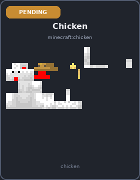

- **Identifier:** `minecraft:chicken`
- **Texture:** `textures/entity/chicken/chicken.png`
- **Note:** Auto-added — set approved true after visual review

### ⏳ Creeper (`creeper`)

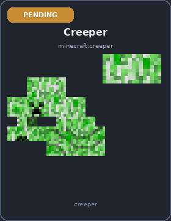

- **Identifier:** `minecraft:creeper`
- **Texture:** `textures/entity/creeper/creeper.png`
- **Note:** Auto-added — set approved true after visual review

### ⏳ Elder Guardian (`elder_guardian`)

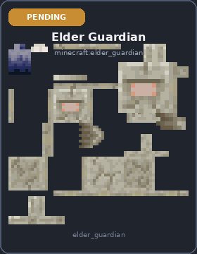

- **Identifier:** `minecraft:elder_guardian`
- **Texture:** `textures/entity/guardian_elder.png`
- **Note:** Auto-added — set approved true after visual review

### ⏳ Enderman (`enderman`)

_no preview_

- **Identifier:** `minecraft:enderman`
- **Texture:** `textures/entity/enderman/enderman.png`
- **Note:** Auto-added — set approved true after visual review

### ⏳ Ghast (`ghast`)

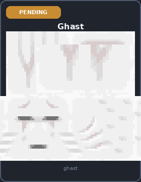

- **Identifier:** `minecraft:ghast`
- **Texture:** `textures/entity/ghast/ghast.png`
- **Note:** Auto-added — set approved true after visual review

### ⏳ Guardian (`guardian`)

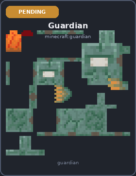

- **Identifier:** `minecraft:guardian`
- **Texture:** `textures/entity/guardian.png`
- **Note:** Auto-added — set approved true after visual review

### ⏳ Horse (`horse`)

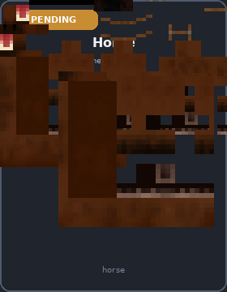

- **Identifier:** `minecraft:horse`
- **Texture:** `textures/entity/horse/horse_brown.png`
- **Note:** Auto-added — set approved true after visual review

### ⏳ Iron Golem (`iron_golem`)

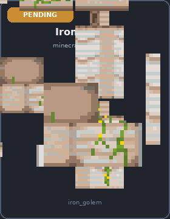

- **Identifier:** `minecraft:iron_golem`
- **Texture:** `textures/entity/iron_golem.png`
- **Note:** Auto-added — set approved true after visual review

### ⏳ Pig (`pig`)

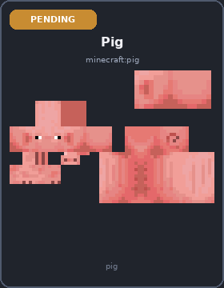

- **Identifier:** `minecraft:pig`
- **Texture:** `textures/entity/pig/pig.png`
- **Note:** Auto-added — set approved true after visual review

### ⏳ Pillager (`pillager`)

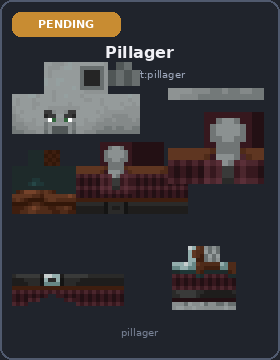

- **Identifier:** `minecraft:pillager`
- **Texture:** `textures/entity/pillager.png`
- **Note:** Auto-added — set approved true after visual review

### ⏳ Ravager (`ravager`)

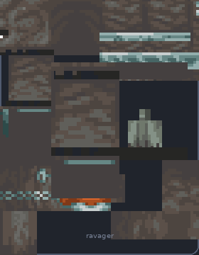

- **Identifier:** `minecraft:ravager`
- **Texture:** `textures/entity/illager/ravager.png`
- **Note:** Auto-added — set approved true after visual review

### ⏳ Skeleton (`skeleton`)

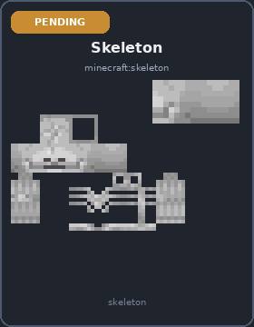

- **Identifier:** `minecraft:skeleton`
- **Texture:** `textures/entity/skeleton/skeleton.png`
- **Note:** Auto-added — set approved true after visual review

### ⏳ Slime (`slime`)

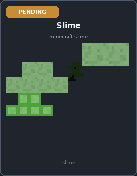

- **Identifier:** `minecraft:slime`
- **Texture:** `textures/entity/slime/slime.png`
- **Note:** Auto-added — set approved true after visual review

### ⏳ Spider (`spider`)

_no preview_

- **Identifier:** `minecraft:spider`
- **Texture:** `textures/entity/spider/spider.png`
- **Note:** Auto-added — set approved true after visual review

### ⏳ Villager (`villager`)

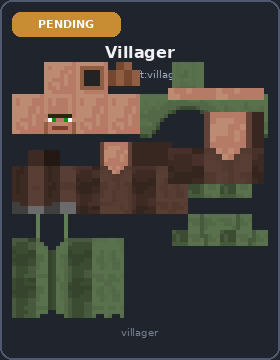

- **Identifier:** `minecraft:villager`
- **Texture:** `textures/entity/villager/villager.png`
- **Note:** Auto-added — set approved true after visual review

### ⏳ Warden (`warden`)

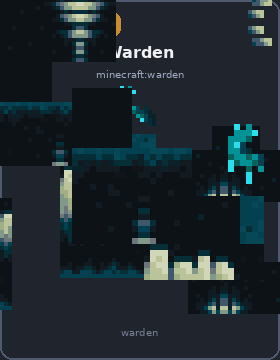

- **Identifier:** `minecraft:warden`
- **Texture:** `textures/entity/warden/warden.png`
- **Note:** Auto-added — set approved true after visual review

### ⏳ Witch (`witch`)


- **Identifier:** `minecraft:witch`
- **Texture:** `textures/entity/witch.png`
- **Note:** Auto-added — set approved true after visual review

### ⏳ Wither Boss (`wither_boss`)


- **Identifier:** `minecraft:wither_boss`
- **Texture:** `textures/entity/wither_boss/wither.png`
- **Note:** Auto-added — set approved true after visual review

### ⏳ Wither Skeleton (`wither_skeleton`)

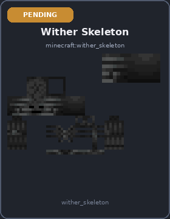

- **Identifier:** `minecraft:wither_skeleton`
- **Texture:** `textures/entity/skeleton/wither_skeleton.png`
- **Note:** Auto-added — set approved true after visual review

### ⏳ Wolf (`wolf`)

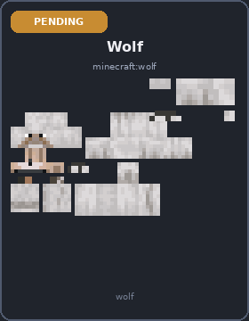

- **Identifier:** `minecraft:wolf`
- **Texture:** `textures/entity/wolf/wolf.png`
- **Note:** Auto-added — set approved true after visual review

### ⏳ Zombie (`zombie`)

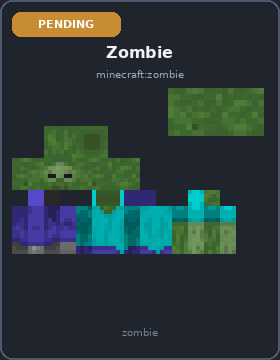

- **Identifier:** `minecraft:zombie`
- **Texture:** `textures/entity/zombie/zombie.png`
- **Note:** Auto-added — set approved true after visual review
